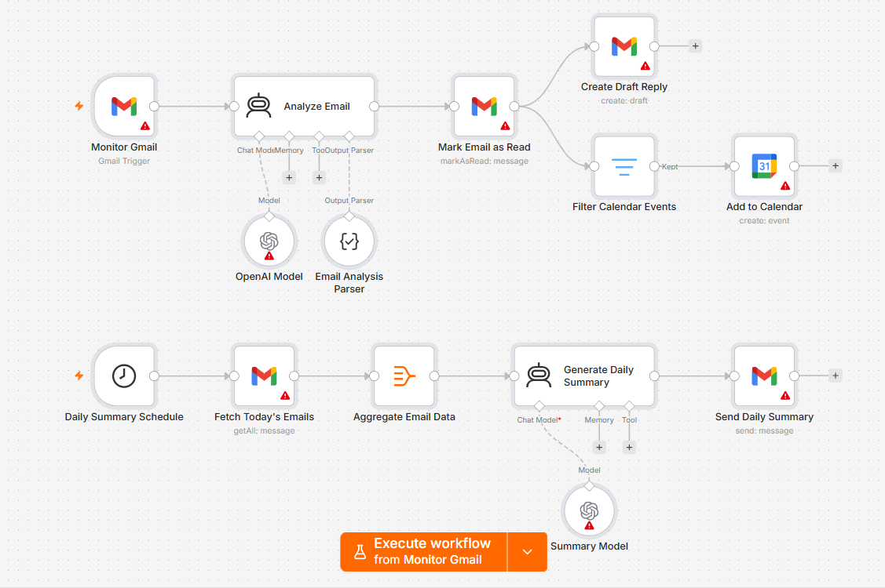

# AI Email Assistant

An event-driven email workflow that monitors incoming messages, extracts what needs attention, prepares draft replies, identifies calendar events, and turns inbox activity into structured actions.



## The Problem

An inbox is not just a collection of messages.

A single email can contain a task, an interview invitation, a meeting, an opportunity, a deadline, or something that needs a response. The real work often begins after reading it:

- deciding how important it is
- understanding what action is required
- preparing a response
- adding a meeting to the calendar
- remembering to follow up later

The problem is not only email volume. It is the repeated effort required to turn incoming information into action.

## What I Built

I built an event-driven workflow that monitors unread emails and converts each message into structured information.

For every incoming email, the workflow can identify:

- the email category
- whether it contains an interview or job opportunity
- action items
- priority
- a suggested reply
- calendar event details, when relevant

After the analysis, the workflow can:

- mark the processed email as read
- create a draft reply
- create a calendar event when event details are detected
- retain structured information for later use

A separate scheduled flow can also turn processed inbox activity into a concise daily summary.

## How It Works

```text
Unread Email Arrives
        ↓
Analyze Message Context
        ↓
Classify + Extract Actions
        ↓
Structured Email Output
        ↓
Mark as Processed
        ↓
   ┌───────────────┬──────────────────┐
   ↓               ↓                  ↓
Draft Reply   Calendar Event    Structured Record


Processed Email Activity
        ↓
Generate Daily Summary
        ↓
Send Summary by Email