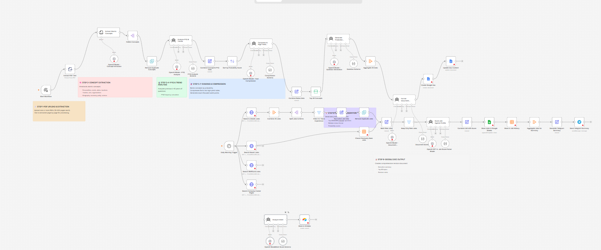

# AI Intent Scoring

An AI-assisted workflow that receives customer browsing activity, scores it across four behavioral signals, and writes the result to Airtable for downstream use.



## The Problem

Not every customer who visits a product page is equally likely to buy.

Some have spent a long time browsing, viewed the same product multiple times, added something to a cart, or returned across several sessions. Others landed once and left. Treating those two customers the same way — with identical messaging or follow-up timing — misses the signal that one of them is much closer to a decision.

The challenge is translating passive browsing behavior into something actionable.

## What I Built

I built a workflow that takes a customer's browsing history as input and uses an AI model to score their purchase intent across four signals.

The workflow accepts:

- customer ID
- total time spent (seconds)
- product views (list)
- cart additions (list)
- repeat visit count

The AI model scores each signal individually:

- `timeSpentScore` — more time spent corresponds to higher intent (1000+ seconds treated as high)
- `productViewScore` — multiple views of the same product increase the score
- `cartAdditionScore` — any cart addition is treated as a strong intent signal
- `repeatVisitScore` — three or more visits raise the score

An overall `intentScore` from 1–10 is returned alongside a reasoning summary. All fields are written to an Airtable record for the customer.

The scores are the model's interpretation of the input signals — they are not trained on historical purchase data and do not represent a calibrated prediction of actual conversion probability.

**Before running:** configure an Airtable base and table in the "Store in Airtable" node. The workflow is triggered manually and expects the input data to include `customerId` and a `browsingHistory` object with the fields listed above.

## How It Works

```text
Manual Trigger (customer browsing data)
        ↓
Analyze Intent
  timeSpentScore · productViewScore
  cartAdditionScore · repeatVisitScore
  intentScore (1–10) · reasoning
        ↓
Store in Airtable
  customerId · intentScore · reasoning
  signal scores · analyzedAt
```
