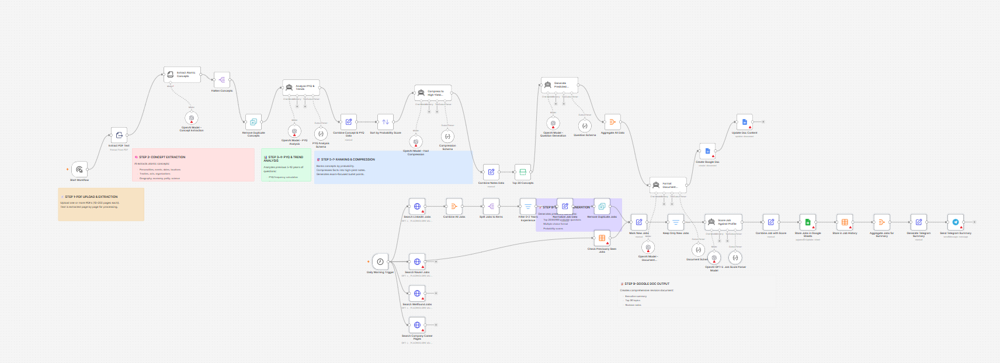

# AI Job Intelligence Agent

A scheduled workflow that queries multiple job sources each morning, deduplicates and filters results, scores each new posting against a fixed candidate profile, logs matches to Google Sheets, and sends a ranked daily summary via Telegram.



## The Problem

Job hunting at the early-career stage involves checking multiple platforms daily, most of which surface the same postings repeatedly.

Beyond volume, the bigger issue is relevance. A job board returns results based on keywords, not on how well a specific posting actually matches a candidate's skills, preferred location, and experience range. Deciding which postings to prioritize still requires reading each one manually.

Doing this across four separate sources every day is the kind of task that is easy to deprioritize.

## What I Built

I built a workflow that runs every morning at 8 AM, collects job postings from four sources, and scores each new one against a hardcoded candidate profile.

The workflow handles:

- parallel queries to LinkedIn, Naukri, Wellfound, and company career pages
- filtering to postings in the 0–2 years experience range
- normalization of job fields across sources (title, company, location, skills, salary, application URL)
- deduplication by title and company
- comparison against previously seen jobs stored in a data table
- AI scoring of each new job against the candidate profile (skills, location preference, interests)
- structured output with a match score (0–100), match reason, matching skills, and missing skills
- logging of scored jobs to Google Sheets
- a job history data table updated with each run to track what has been seen
- a Telegram message with the top 5 new matches ranked by score

**Important:** All four job source URLs are placeholders. The LinkedIn, Naukri, Wellfound, and company career page nodes each contain `<__PLACEHOLDER_VALUE__>` URLs that must be replaced with real API endpoints or scraping targets before the workflow will fetch live data. The Google Sheets document ID and sheet name must also be configured. The candidate profile (skills, location, interests) is hardcoded in the "Score Job Against Profile" node prompt and should be updated to reflect the actual candidate.

## How It Works

```text
Daily Trigger (8:00 AM)
        ↓
  ┌────────────────────────────────────────────────┐
  ↓            ↓               ↓                   ↓
Search       Search          Search            Search
LinkedIn     Naukri          Wellfound         Company
Jobs         Jobs            Jobs              Career Pages
  ↓
Combine All Jobs → Split to Items
        ↓
Filter: 0–2 Years Experience
        ↓
Normalize Job Data
        ↓
Remove Duplicate Jobs (by title + company)
        ↓
Check Previously Seen Jobs (data table)
        ↓
Mark New Jobs → Keep Only New Jobs
        ↓
Score Job Against Profile (0–100)
  score · matchReason · skillsMatch · missingSkills
        ↓
Combine Job with Score
        ↓
Store Jobs in Google Sheets
        ↓
Store in Job History (data table)
        ↓
Aggregate Jobs for Summary
        ↓
Generate Telegram Summary (top 5 by score)
        ↓
Send Telegram Message
```
