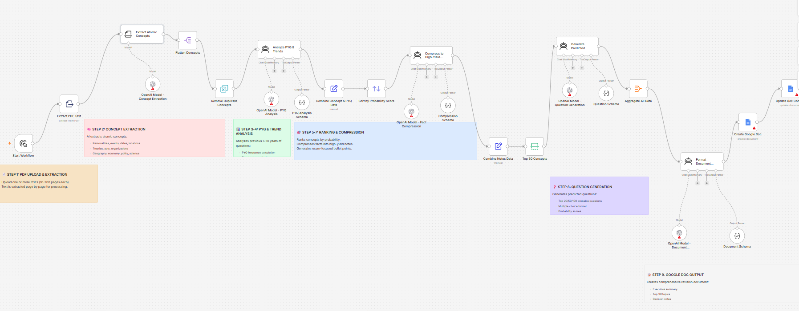

# AI Powered Exam Intelligence

An AI-assisted workflow that turns competitive exam study material into ranked revision notes, probability-scored topics, and predicted practice questions — delivered as a structured Google Doc.



## The Problem

Preparing for a competitive exam like UPSC Prelims or SSC CGL means working through a large volume of material without a clear sense of what actually matters.

Topics appear with equal weight in textbooks, but exams do not test everything equally. Some concepts appear repeatedly across years, others rarely or never. Without that pattern, a candidate has no principled way to prioritize where to spend time.

The result is preparation that covers a lot of ground but may underinvest in the topics most likely to appear.

## What I Built

I built a workflow that takes one or more exam study PDFs, extracts the concepts inside them, and scores each concept against a weighted combination of previous-year question frequency, trend direction, and historical importance.

The workflow processes the material into:

- atomic concepts extracted by category (personalities, events, treaties, acts, organizations, geography, economy, polity, science, current affairs)
- duplicate concepts removed by name
- a probability score per concept: `(pyqFrequency × 0.4) + (trendScore × 0.3) + (historicalImportance × 0.3)`
- concepts ranked by probability score
- high-yield revision notes compressed to bullet points for the top 30 concepts
- 3–5 predicted multiple-choice questions per concept with options, correct answers, and explanations
- a formatted Google Doc with eight sections: executive summary, top 30 topics, revision notes, important dates, important personalities, important events, predicted questions, and a last-minute revision sheet

The probability score is a weighted heuristic based on what the AI model estimates about frequency and trend — it is not derived from a live PYQ database. The exam type must be set manually in two placeholder fields before running.

**Before running:** replace `<__PLACEHOLDER_VALUE__Selected Exam__>` in both the "Analyze PYQ & Trends" and "Generate Predicted Questions" nodes with the target exam name, and set your Google Drive folder ID in the "Create Google Doc" node.

## How It Works

```text
Manual Trigger
      ↓
Extract PDF Text (page by page)
      ↓
Extract Atomic Concepts (structured schema)
      ↓
Flatten Concepts → Remove Duplicates
      ↓
Analyze PYQ & Trends (per concept)
      ↓
Combine Concept & PYQ Data
  pyqFrequency · trendScore · historicalImportance · probabilityScore
      ↓
Sort by Probability Score (descending)
      ↓
Compress to High-Yield Notes (per concept)
      ↓
Combine Notes Data → Top 30 Concepts
      ↓
Generate Predicted Questions (3–5 MCQs per concept)
      ↓
Aggregate All Data
      ↓
Format Document Content (8 sections)
      ↓
Create Google Doc → Update Doc Content
```
