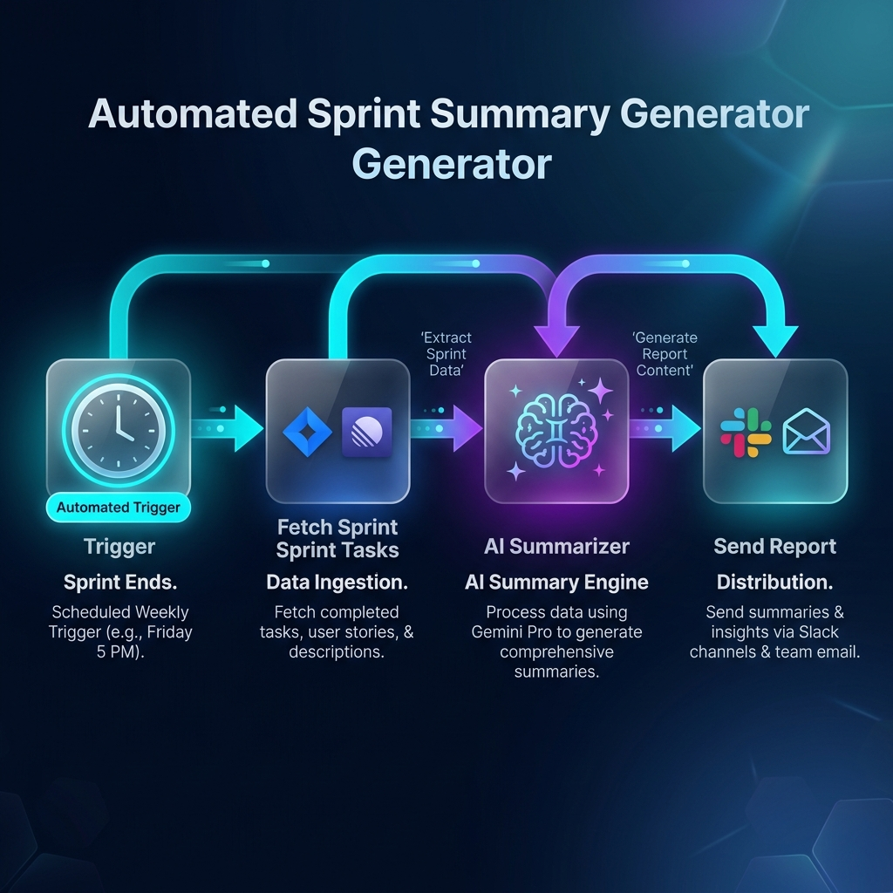

# 🏃‍♂️ Sprint Summary Generator

An automated workflow designed to eliminate manual sprint reporting by aggregating completed and pending tasks, generating insightful AI summaries, and distributing executive updates to your team's communication channels.

---

## 📊 Workflow Architecture



### 🔗 Key Stages

1. **Scheduled Trigger**: Initiates automatically at the end of a sprint (e.g., Friday at 5:00 PM or Monday at 9:00 AM).
2. **Data Ingestion**: Fetches sprint metrics, completed issues, blockers, and carry-over tasks from project management tools (Jira / Linear / GitHub Projects).
3. **AI Summarization**: Uses an LLM (Gemini 3.1 Pro / OpenAI) to synthesize raw task data into concise executive insights, team achievements, and risk assessments.
4. **Multi-Channel Distribution**: Broadcasts the formatted summary to Slack/Microsoft Teams and logs an archival copy in Notion/Confluence.

---

## 📂 Folder Structure

```text
sprint-summary-generator/
├── README.md                                  # Documentation & Setup Guide
├── workflow/
│   └── sprint-summary-generator.json          # Workflow JSON Definition
└── assets/
    └── workflow-overview.png                  # Visual architecture diagram
```

---

## ⚙️ Setup & Installation

### 1. Prerequisites
- **Automation Platform**: n8n, Make, or custom JSON workflow engine.
- **API Credentials**:
  - Project Management Tool API Key (Jira / Linear / GitHub)
  - LLM API Key (Google Gemini / OpenAI)
  - Messaging Webhook URL (Slack / Teams / Discord)

### 2. Import Workflow
1. Navigate to your automation platform.
2. Select **Import from File** or **Import from JSON**.
3. Upload `workflow/sprint-summary-generator.json`.

### 3. Configure Credentials & Variables
Update the environment variables or credential nodes within the imported workflow:
- `PROJECT_ID`: Your target Sprint/Project ID.
- `AI_MODEL`: Set to your preferred LLM (default: `gemini-3.1-pro`).
- `WEBHOOK_URL`: Your Slack/Teams destination channel webhook.

---

## 📝 Example AI Summary Output

> **🚀 Sprint 24 Executive Summary**
> - **✅ Completed Tasks**: 18 tickets closed across Frontend, Backend, and DevOps.
> - **🌟 Key Highlights**: Successfully launched the new user authentication flow and reduced API P99 latency by 35%.
> - **⚠️ Blockers & Risks**: Payment gateway sandbox integration delayed due to third-party API downtime; moved to Sprint 25.
> - **🎯 Next Sprint Focus**: Checkout page redesign and end-to-end load testing.
