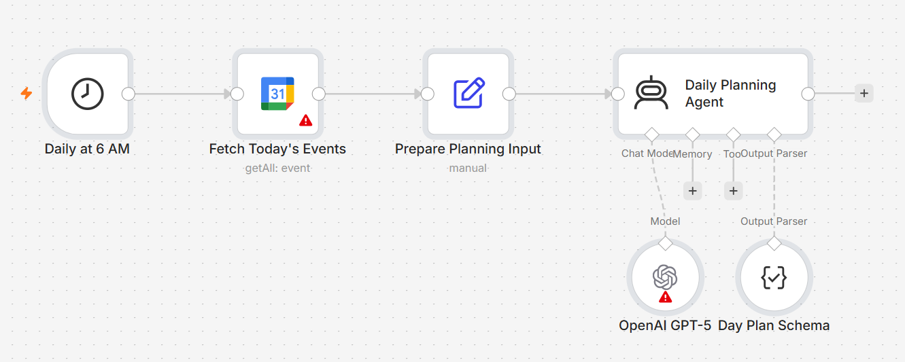

# Day Planner

An AI-assisted daily planning workflow that combines calendar commitments, backlog tasks, and personal priorities to create a realistic plan for the day.



## The Problem

A calendar shows where time is already committed. A task list shows what needs to be done.

Neither, on its own, answers the harder question:

**What can I realistically get done today?**

It is easy to build an ambitious task list without accounting for meetings, fragmented time, competing priorities, or the amount of focused work the day can actually support.

The result is often a plan that looks productive in the morning and becomes unrealistic by afternoon.

## What I Built

I built a workflow that runs at the start of the day and creates a structured plan from three sources of context:

- today's calendar events
- a backlog of tasks
- current priority context

The workflow identifies fixed commitments first, then uses the remaining time and priorities to suggest:

- the top three priorities for the day
- fixed commitments
- focused work blocks
- important follow-ups
- scheduling risks
- recommended changes to an overloaded or conflicting plan

The goal is not to fit every task into one day. It is to create a plan that reflects the time actually available.

## How It Works

```text
Daily Schedule Trigger
          ↓
Fetch Today's Calendar Events
          ↓
Combine Events + Tasks + Priorities
          ↓
Analyze Available Time and Workload
          ↓
Generate a Structured Day Plan
          ↓
Priorities · Commitments · Focus Blocks
Follow-ups · Risks · Recommended Changes