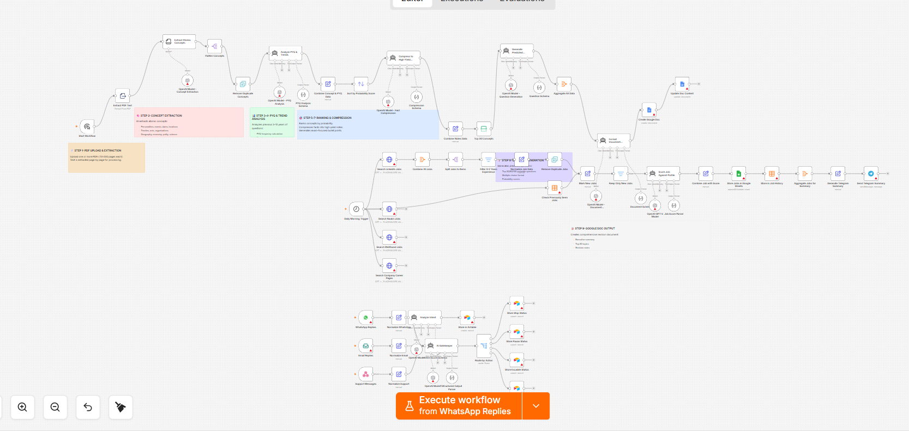

# Gatekeeper Agent

An AI-assisted workflow that monitors incoming customer messages across WhatsApp, email, and a webhook endpoint, classifies the intent of each message, and routes it to one of four outcomes: stop messaging, pause automation, escalate to support, or continue.



## The Problem

Automated messaging sequences send messages without knowing what the customer has replied.

A customer who responds with "please stop" or "I need help" or "unsubscribe" is still receiving automated follow-ups unless something intercepts and acts on that reply. Ignoring or misclassifying those signals creates a poor customer experience and, in the case of opt-out requests, a compliance risk.

The gap is between the outbound automation and the inbound response — there is no layer that reads replies and decides what should happen next.

## What I Built

I built a workflow that listens for incoming customer replies across three channels, runs each message through an AI classifier, and writes one of four outcomes to Airtable based on what the message contains.

The workflow monitors:

- WhatsApp replies (via WhatsApp trigger)
- Email replies (via IMAP)
- Messages sent to a `/support-message` webhook endpoint

Each incoming message is normalized into a common structure (customer ID, message text, channel, timestamp) before analysis.

The AI classifier examines the message for:

- unsubscribe intent (stop, opt out, remove me)
- support requests (questions, problems, help needed)
- negative sentiment (complaints, frustration)
- explicit requests to speak with a person
- signals that a purchase has been completed

Based on the classification, the workflow routes to one of four paths:

- `stop_messaging` — writes a "stopped" record to Airtable
- `pause_automation` — writes a "paused" record
- `escalate_to_support` — writes an "escalated" record
- `continue_automation` — writes an "active" record

Each path records the customer ID, channel, action, intent, sentiment, reason, and timestamp. The workflow is designed to be conservative: the classifier prompt instructs the model to err toward pausing or escalating when sentiment is ambiguous.

**Before running:** configure WhatsApp and IMAP credentials, set Airtable base and table IDs in each of the four storage nodes, and connect an OpenAI credential. The workflow does not send any reply messages — downstream action based on the stored status is handled separately.

## How It Works

```text
  ┌────────────────────────────────────┐
  ↓                ↓                   ↓
WhatsApp       Email IMAP          Webhook
Replies        Replies         (support-message)
  ↓                ↓                   ↓
Normalize    Normalize Email    Normalize Support
WhatsApp
  └──────────────┬─────────────────────┘
                 ↓
          AI Gatekeeper
    (intent · sentiment · action · confidence)
                 ↓
         Route by Action
  ┌────────┬────────┬──────────┬──────────┐
  ↓        ↓        ↓          ↓
Stop     Pause   Escalate   Continue
Store    Store    Store       Store
Status   Status   Status      Status
(Airtable upsert by customerId)
```
