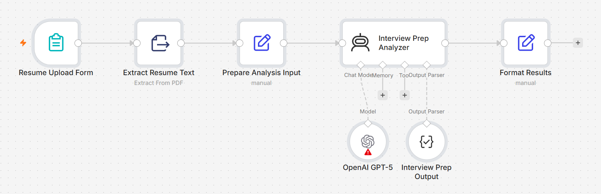

# Interview Prep Assistant

An AI-assisted workflow that turns a candidate's resume and target role into personalized interview preparation — including tailored questions, a mock interview scenario, profile gaps, and actionable improvement areas.



## The Problem

Interview preparation is often too generic.

Candidates search for common questions based on a job title, but interviews are usually shaped by something more specific: the combination of the role they are targeting and the experience they have already claimed on their resume.

That creates a gap between generic preparation and the questions a candidate is actually likely to face.

## What I Built

I built a workflow that uses two inputs:

- the candidate's resume
- the role they are targeting

The workflow extracts the resume content, combines it with the target role, and generates a structured preparation plan containing:

- tailored interview questions
- a realistic mock interview scenario
- potential weaknesses or profile gaps
- specific areas to improve before the interview

The goal is to make preparation more contextual to the candidate instead of generating another generic list of interview questions.

## How It Works

```text
Resume Upload + Target Role
            ↓
     Extract Resume Text
            ↓
   Prepare Candidate Context
            ↓
 Analyze Resume Against Role
            ↓
    Structure the Output
            ↓
 Personalized Interview Prep