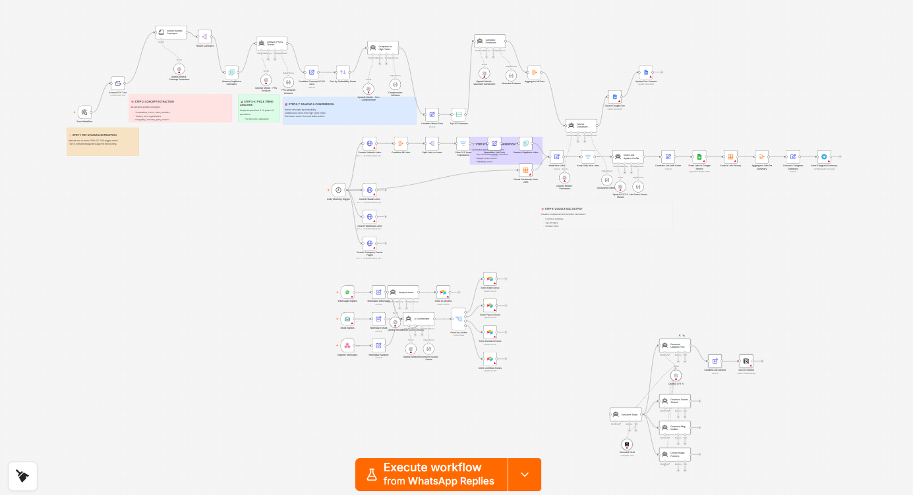

# Social Media Content Factory

An AI-assisted workflow that takes a topic, researches it using a live search tool, and generates a LinkedIn post, a Twitter thread, a blog outline, and image prompts — all saved as a single draft page in Notion.



## The Problem

Creating content across multiple platforms from the same idea is repetitive work.

A topic that is worth writing about usually needs a different form for each channel: a short professional post for LinkedIn, a threaded breakdown for Twitter, a structured outline for a long-form article, and visual ideas to go alongside any of them. Writing each version from scratch takes time, and the research behind them is often done once and then partially reused.

The friction is not the ideas. It is the effort to turn one idea into four different formats.

## What I Built

I built a workflow that takes a topic as input, researches it using Perplexity, and then generates four content formats in parallel from the same research output.

The workflow produces:

- a LinkedIn post (professional tone, under 1300 characters, with hashtags)
- a Twitter thread (5–7 tweets, numbered, under 280 characters each)
- a blog post outline (introduction, main sections with subsections, conclusion)
- three image generation prompts suitable for DALL-E or Midjourney

All four outputs are combined and saved as a single page in a Notion database with the topic as the title and a "Draft" status.

The workflow does not publish to LinkedIn, Twitter, or any other platform. Content is written to Notion for review and manual publishing.

**Before running:** connect a Notion integration and select a database in the "Save to Notion" node. The workflow expects the incoming data to include a `topic` field.

## How It Works

```text
Manual Trigger (topic input)
        ↓
Research Topic
  (Perplexity search, last month recency)
        ↓
  ┌─────────────────────────────────────────┐
  ↓           ↓              ↓              ↓
Generate    Generate      Generate      Create
LinkedIn    Twitter       Blog          Image
Post        Thread        Outline       Prompts
  ↓
Combine All Content
  topic · research · linkedinPost
  twitterThread · blogOutline · imagePrompts
        ↓
Save to Notion (Draft page)
```
