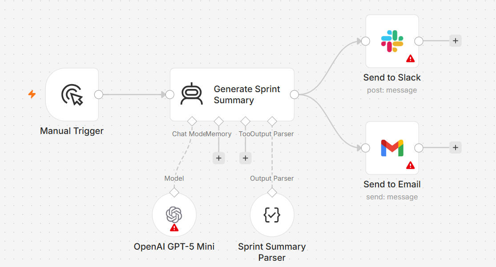

# Sprint Summary Generator

An AI-assisted workflow that turns scattered sprint updates into a concise, stakeholder-ready summary of progress, wins, blockers, risks, and next steps.



## The Problem

Sprint information often exists across tickets, team updates, bug reports, and individual notes.

The team working on the sprint may understand the details, but stakeholders usually need something different: a short view of what changed, what is blocked, what needs attention, and what happens next.

Writing that summary manually every sprint is repetitive, and important context can easily get buried.

## What I Built

I built a workflow that takes sprint updates, structures the important information, and generates a concise summary that can be shared with stakeholders through Slack or email.

The workflow focuses on five things:

- progress made during the sprint
- key wins and outcomes
- blockers affecting delivery
- risks that need attention
- priorities and next steps

## How It Works

```text
Sprint Updates
      ↓
Structure the Context
      ↓
Generate the Sprint Summary
      ↓
Progress · Wins · Blockers · Risks · Next Steps
      ↓
Slack or Email